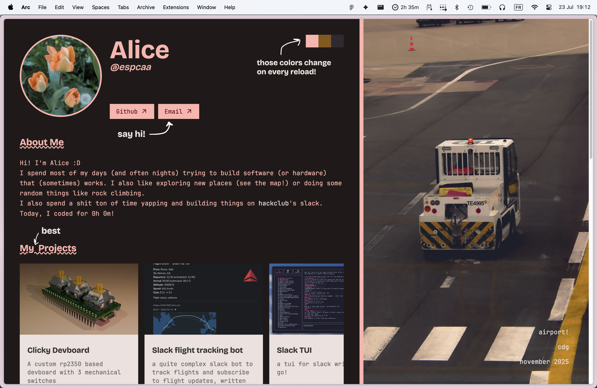

# my website!

right now, you can check it out [here](https://alice.hackclub.cc/).



## how to run locally

first, run this:

```
git clone https://github.com/espcaa/website
bun i
bun run dev
```

and then create a .env file with the following contents:

```
HACKATIME_KEY=your_hackatime_key_here
```

now, if you want to build and run the production version, you can do this:

```
bun run build
bun dist/server/entry.mjs
```

## docker compose

if you're lazy and want this running asap in docker, you can just do this:

```
docker compose up -d --build
```

## random scripts

please run before building/running locally

```
bun run scripts/optimize-wallpapers.ts
bun run scripts/extract-wallpaper-color.ts
```

## notes

ai was used to learn responsive design in css and to help make some architectural choices. i also used inline ai suggestions (copilot) (basically like the rest of my projects)
